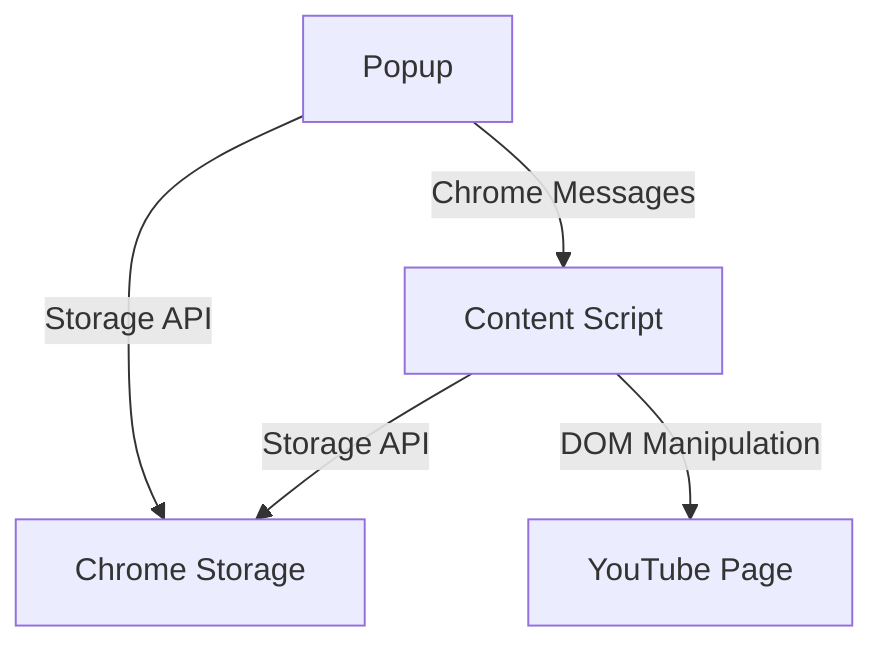

# YouTube Overlay - Arkkitehtuuri

## Tekninen pino

### Frontend
- **Framework**: Vue 3
- **Kieli**: TypeScript
- **Bundler**: Vite
- **Tyylittely**: CSS (scoped)

### Selainlaajennus
- **API**: Chrome Extension API
- **Manifest**: V3
- **Storage**: Chrome Storage API

## Kansiorakenne

```
├── dist/                 # Käännetyt tiedostot
│   ├── icons/           # Laajennuksen ikonit
│   ├── assets/          # CSS ja muut resurssit
│   ├── content.js       # Content script
│   ├── popup.js         # Popup-ikkunan koodi
│   └── background.js    # Taustapalvelu
│
├── src/                 # Lähdekoodi
│   ├── components/      # Vue-komponentit
│   │   ├── Overlay.vue  # Tekstin overlay-komponentti
│   │   └── ...
│   │
│   ├── composables/     # Vue-composables
│   │   └── useOverlayText.ts  # Tekstin hallinta
│   │
│   ├── content/         # Content script
│   │   └── index.ts     # YouTube-sivun manipulointi
│   │
│   └── popup/           # Popup-ikkuna
│       ├── App.vue      # Popup-sovelluksen pääkomponentti
│       └── index.html   # Popup HTML
│
├── docs/                # Dokumentaatio
│   ├── readme.md        # Yleiskuvaus
│   ├── architecture.md  # Arkkitehtuuri
│   └── ...
│
└── package.json         # Projektin riippuvuudet
```

## Komponentit

### Content Script
- Injektoidaan YouTube-sivulle
- Luo Vue-sovelluksen overlay-tekstille
- Hallitsee näppäinkomentoja
- Kommunikoi popup-ikkunan kanssa

### Popup
- Erillinen Vue-sovellus
- Mahdollistaa tekstin muokkaamisen
- Tallentaa tekstin Chrome Storage API:n kautta
- Kommunikoi content scriptin kanssa

### Background Service
- Hallitsee laajennuksen elinkaarta
- Käsittelee tapahtumia taustalla

## Kommunikaatio



## Tietovirrat

1. **Tekstin tallennus**
   ```
   Popup -> Chrome Storage -> Content Script -> Overlay
   ```

2. **Näppäinkomennot**
   ```
   YouTube Page -> Content Script -> Overlay
   ```

3. **Tilan synkronointi**
   ```
   Chrome Storage <-> Content Script <-> Popup
   ```

## Testausstrategia
- Yksikkötestit: Komponenttien ja apufunktioiden testaus
- E2E-testit: Käyttäjätapausten testaus selaimessa
- Integraatiotestit: Komponenttien välinen vuorovaikutus 