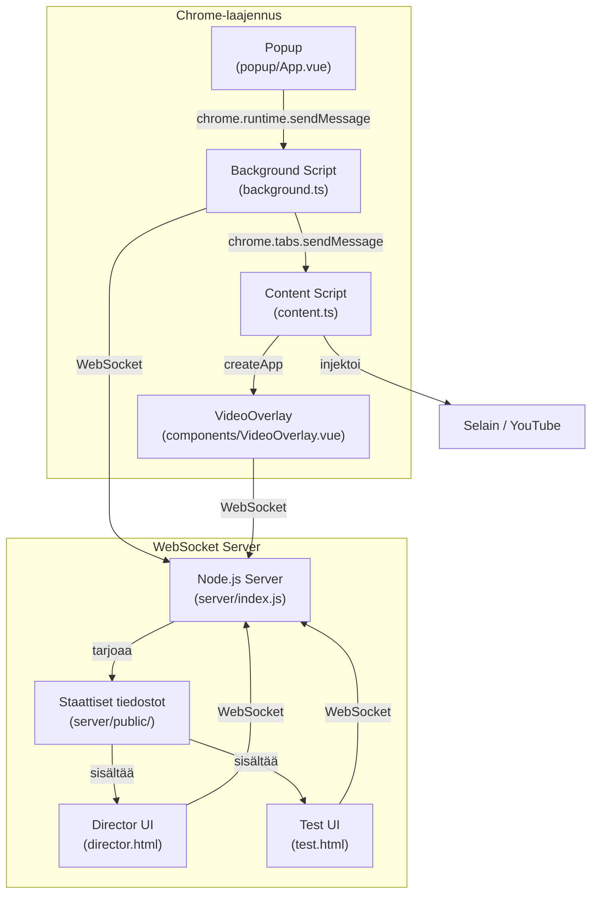
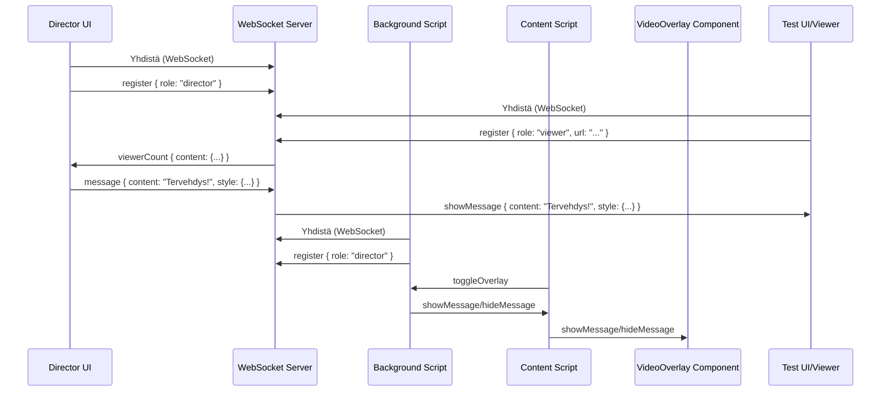
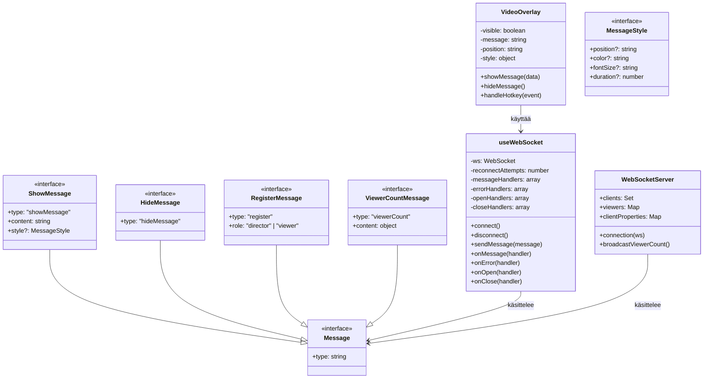
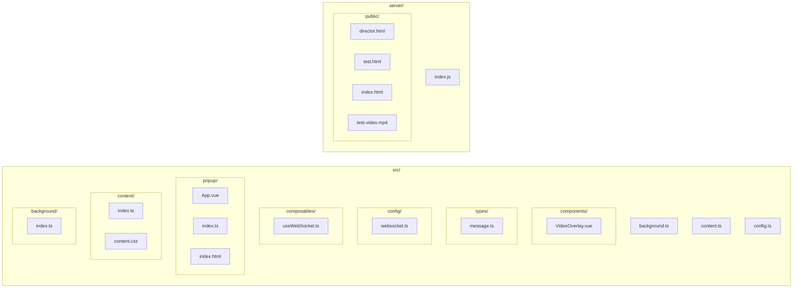
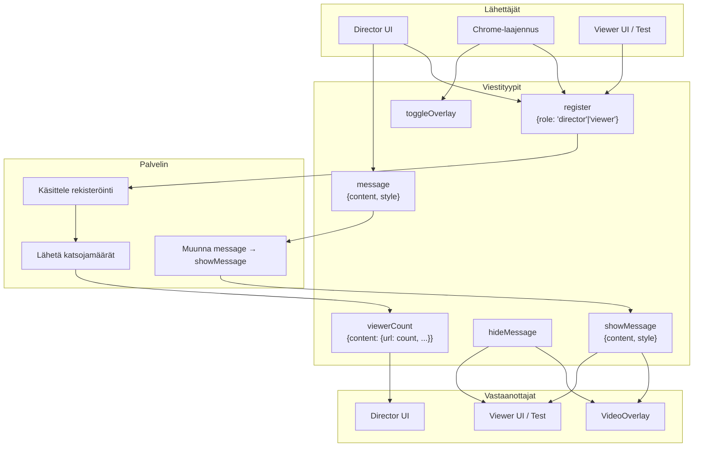
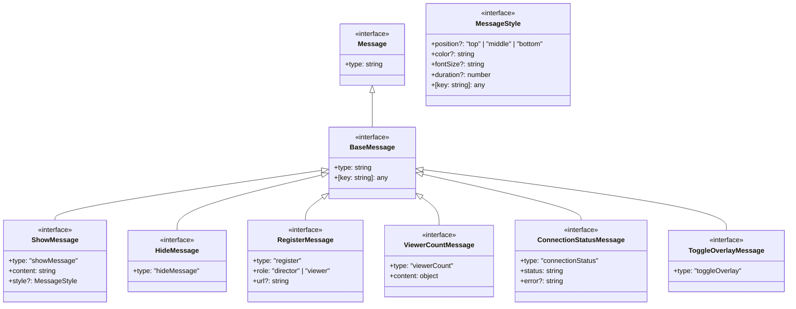
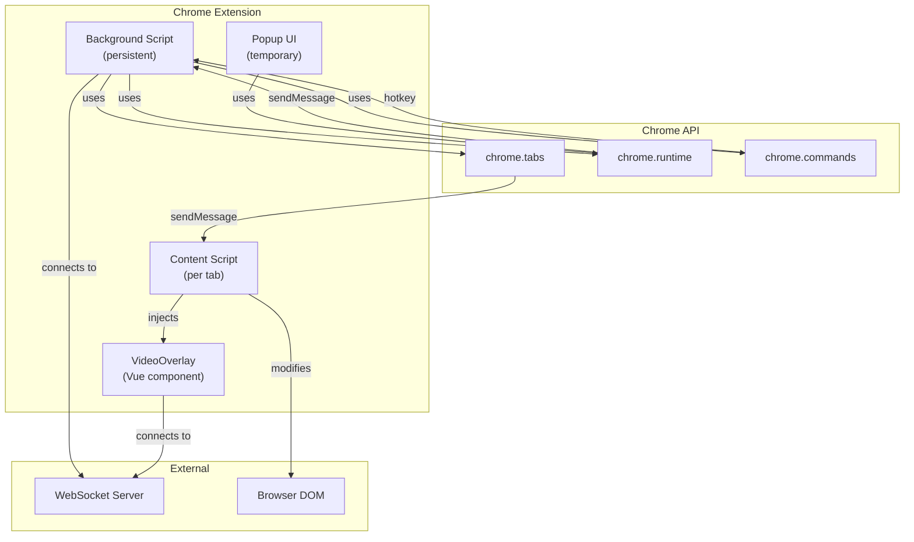

# Video Overlay - Koodipohjan kaaviot

Tässä dokumentissa on Mermaid-kaaviot, jotka kuvaavat Video Overlay -sovelluksen arkkitehtuuria, tiedonkulkua ja komponenttihierarkiaa.

## Sovelluksen arkkitehtuuri

## Tiedonkulku

## Komponenttihierarkia

## Tiedostohierarkia

## WebSocket viestintä

## Viestiprotokolla

## Chrome-laajennuksen arkkitehtuuri

## Avainominaisuudet

1. **Viestien näyttäminen**: Ohjaaja voi lähettää viestejä, jotka näkyvät katsojien videoiden päällä
2. **Näppäinyhdistelmä**: CTRL+SHIFT+9 aktivoi/deaktivoi viestien näkymisen
3. **Katsojamäärän seuranta**: Ohjaaja näkee aktiivisten katsojien määrän
4. **WebSocket-yhteys**: Reaaliaikainen viestintä ohjaajan ja katsojien välillä
5. **Muokattavat viestit**: Viestien tyyliä (sijainti, väri, koko) voi muokata
6. **Useampi käyttöliittymä**: Chrome-laajennus (katsojille) ja web-käyttöliittymä (ohjaajalle) 